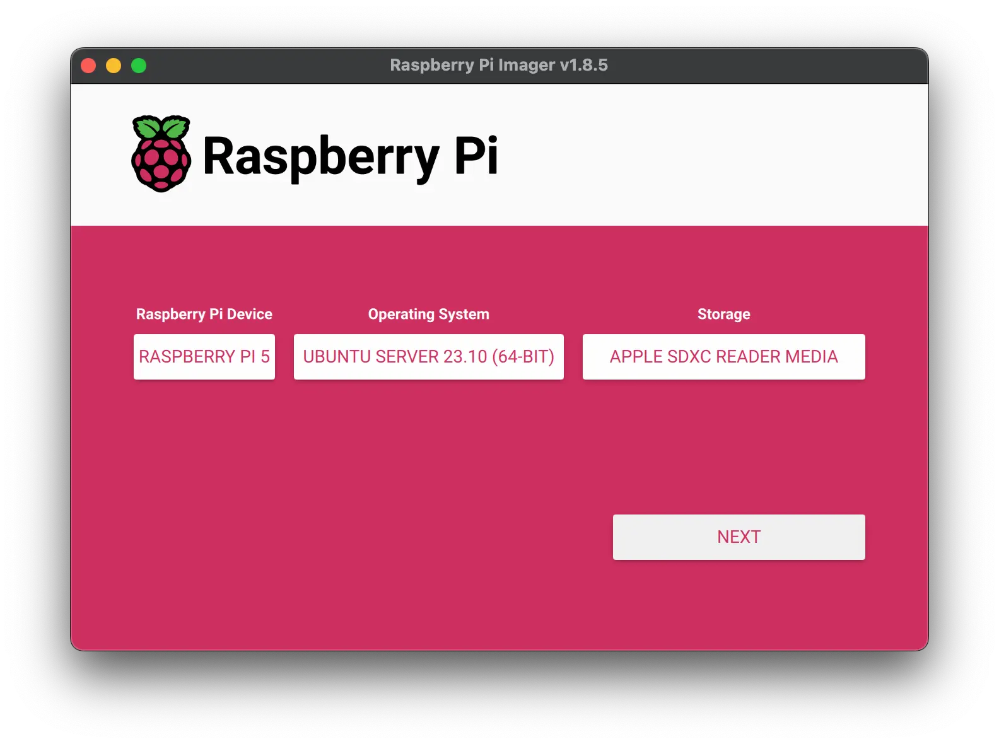
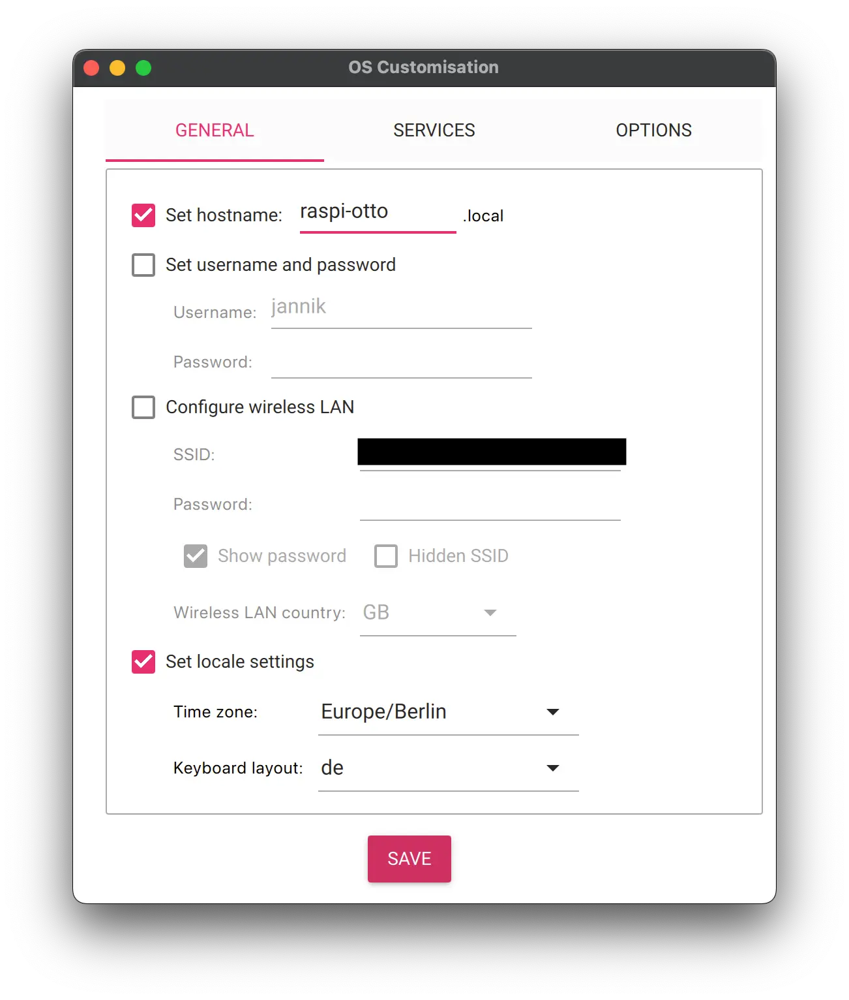
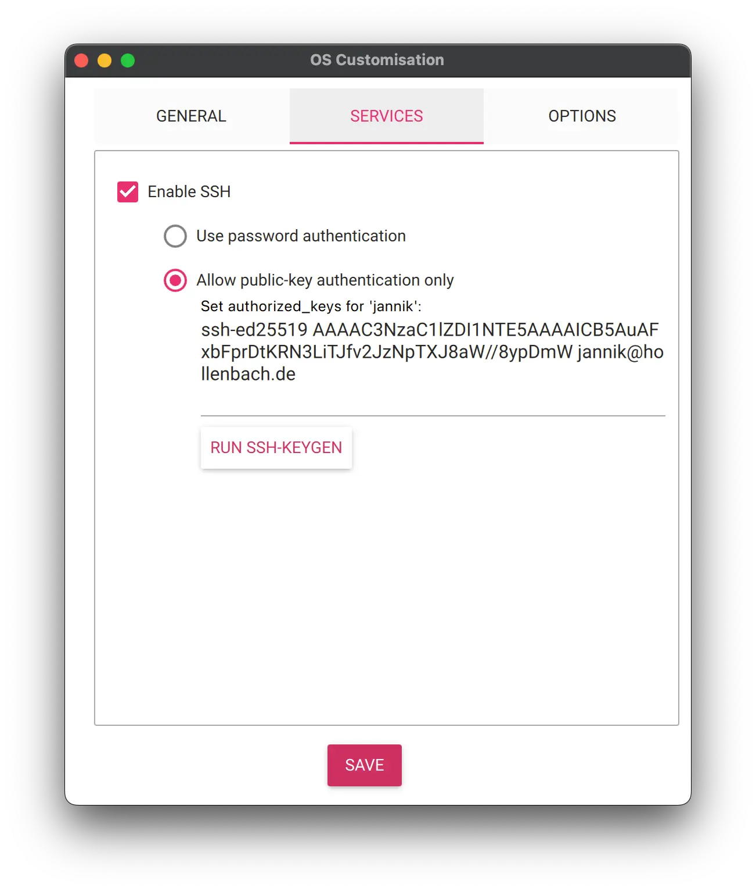

# Local MultiJuicer Setup using Raspberry Pi(s) and k3s

This guide walks you through setting up one or more Raspberry Pis to run a kubernetes cluster using [k3s](https://k3s.io/) and how to install MultiJuicer on it.

## Required Hardware

- 1 computer with an MicroSD / SD card slot to flash the operating system
- 1 or more Raspberry Pi (Model 4b or 5 recommended, older ones might also work)
- 1 * Micro SD Card per RaspberryPi
- 1 * Ethernet cable per RaspberryPi
- 1 Network switch or router

## Step 1. Flashing the operating system on the SD card

To get a operating system on the micro sd card for the raspberry pi you can use the official [RaspberryPi Imager](https://github.com/raspberrypi/rpi-imager) to flash a os image.

### OS Selection

This guide will use Ubuntu as a operating system, RaspberryPi OS should also work but might require additional tweaks which a re not part of this guide.
I'd recommend using the Ubuntu Server variants which doesn't include a desktop environment which allows us to save some resources.



After clicking next the imager will ask if you want to customize the OS. Click "Edit Settings".

### OS Customization: General



I'd recommend giving the RaspberryPi a unique hostname. If you have multiple RaspberryPis it's also helpful to stick a physical label with the hostname somewhere on the RaspberryPi so that you can differentiate them later on.

### OS Customization: Services



To be able to connect to the Pi we are enabling SSH and are putting in our public SSH key.
This will allow us to directly connect to and administer the Pi without having to attach a keyboard and monitor to it.

### Finishing up the config

That's all the config we need.
If you are using ethernet to connect to the Pi I'd recommend not setting up WIFI so that you don't have to deal with multiple network interfaces.

You can now click through the next step(s) and start flashing the OS onto the card.
Flashing the card might take a couple of minutes.

After that is done you can insert the card into the Raspberry Pi

## Step 2. SSH onto RaspberryPi

After setting up the SD Card insert it into the Pi and connect it to power and networking.
The Pi should now be booting and should be available after about a minute.

Next up we can try to connect to it using SSH.
For that we need to know the address of the Pi.
Depending on the network configuration / router you might be able to connect to it using the hostname configured for the flashed SD Card.

Depending on the networking config in your network you might be able to connect to it using just the hostname of the device.

```bash
# using the hostname "raspi-otto" used earlier
ssh raspi-otto
```

If that isn't the case, you have a couple of options (non exhaustive list) to find out the address:

1. Check router (web)interface for active devices in the network. Your Pi should show up in that list
2. Do a nmap scan of your local network. E.g. scanning for devices with open port 22 (ssh) on localnetwork with a `192.168.42.0/24` network: `nmap -p22 192.168.42.0/24`

## Step 3a. Installing the Kubernetes Primary Node (for the first Pi)

SSH into the Pi you've designated as the primary kubernetes node.
This means that it will run the kubernetes control plane components like the kubernetes api-server & controller-manager. For more check the kubernetes docs: https://kubernetes.io/docs/concepts/overview/components/#control-plane-components

Were using [k3s](https://k3s.io/) which is a lightweight kubernetes distribution for edge, homelab and IoT use cases.

```bash
# ssh onto the primary Pi first

# download and install the recommended k3s version
curl -sfL https://get.k3s.io | sh -
```

## Step 3b. Installing the Kubernetes Secondary Nodes (for each additional Pi)

Repeat setup steps 1 & 2 for another Pi & SD card.

### Get the node token from the primary

To register more nodes onto the cluster you need to get the node token from the primary.

```bash
# ssh onto the primary Pi first
sudo cat /var/lib/rancher/k3s/server/node-token 
```

### Install k3s and connect secondary node against primary

```bash
# ssh onto a secondary Pi first

# download and install the recommended k3s version and connect it to the primary node
curl -sfL https://get.k3s.io | K3S_URL=https://raspi-otto:6443 K3S_TOKEN=mynodetoken sh -
```

## Step 4. Access the Kubernetes cluster from your own computer

Copy out `/etc/rancher/k3s/k3s.yaml` from the primary node and integrate it into your local `~/.kube/config.yaml`

E.g. by:

1. Copy `/etc/rancher/k3s/k3s.yaml` to a local file `juice-box.yaml`
2. Open up `juice-box.yaml` in a text editor
3. Replace `default` cluster, context and user name with a choice of your own.
4. Replace `127.0.0.1` in the server address `https://127.0.0.1:6443` with the hostname or ip of your primary node.
5. Use [`konfig`](https://github.com/corneliusweig/konfig) kubectl plugin to merge cluster config into your kube config. `kubectl konfig import --save ./juice-box.yaml`
6. Run `kubectl config set-context juice-box` to change your current default context

You should then be able to run kubectl from your computer against the cluster on the Pi.

```bash
kubectl get nodes
```

## Step 5. Install MultiJuicer

```bash
kubectl create namespace multi-juicer

helm install multi-juicer --namespace multi-juicer oci://ghcr.io/juice-shop/multi-juicer/helm/multi-juicer
```

After a minute or two all MultiJuicer components should be started.
You can check the status by listing the pods in the multi-juicer namespace.

```bash
kubectl --namespace multi-juicer get pods
```

## Step 6. Exposing MultiJuicer to the network

k3s automatically comes with a traefik ingress controller which allows to expose http applications running on the cluster.
k3s will automatically start a traefik worker on all nodes. 
If http requests are send to to port 80 or 443 of a cluster node traefik will forward it to the application of the cluster if you have configured an ingress rule for it.

Ideally you setup a DNS name for MultiJuicer on your local network by setting up a DNS A (IPv4) / AAAA (IPv6) pointing to all cluster nodes.

### With a DNS hostname and a TLS Cert

```bash
# create a kubernetes secret with a tls cert & key
kubectl create secret tls multi-juicer-tls --cert=path/to/tls.cert --key=path/to/tls.key

kubectl create ingress multi-juicer --namespace=multi-juicer --class=traefik --rule="multi-juicer.example.com/*=juice-balancer:3000,tls=multi-juicer-tls"
```

### With a DNS hostname and no TLS Cert

If you don't have DNS setup you can register a ingress rule route all traffic for any host to MultiJuicer.

```bash
kubectl create ingress multi-juicer --namespace=multi-juicer --class=traefik --rule="multi-juicer.example.com/*=juice-balancer:3000"
```

### Without a DNS hostname and no TLS Cert

```bash
kubectl create ingress multi-juicer --namespace=multi-juicer --class=traefik --rule="/*=juice-balancer:3000"
```
