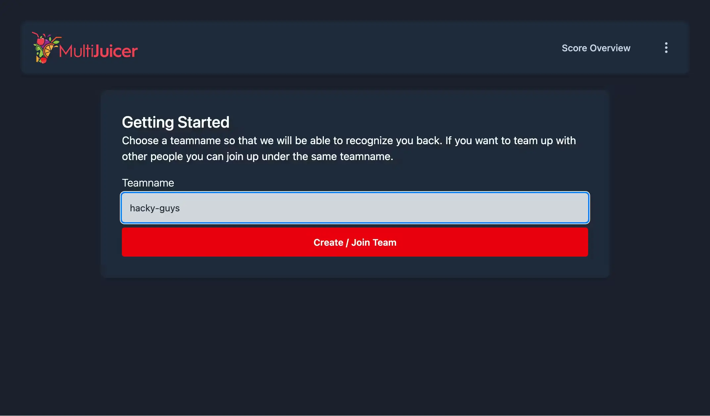
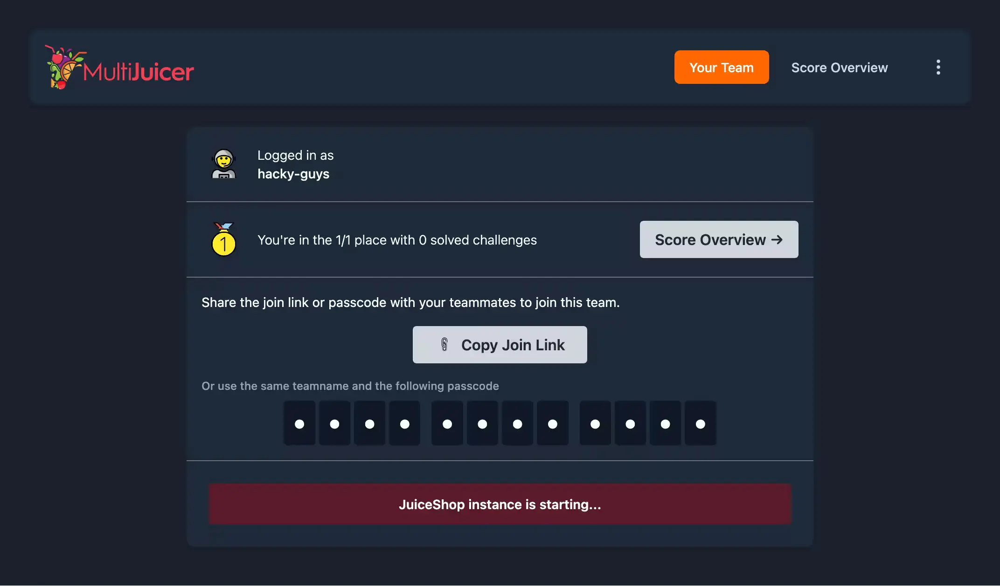
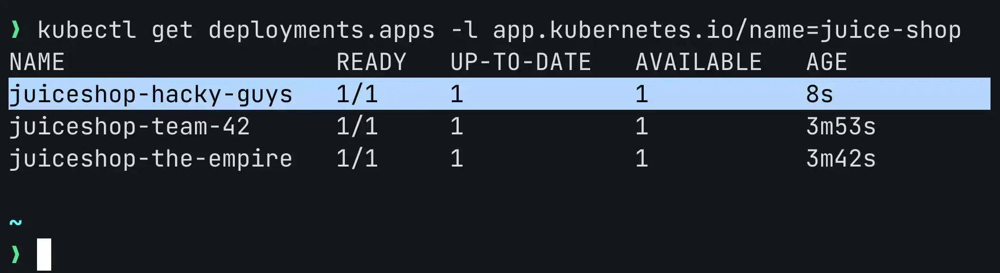
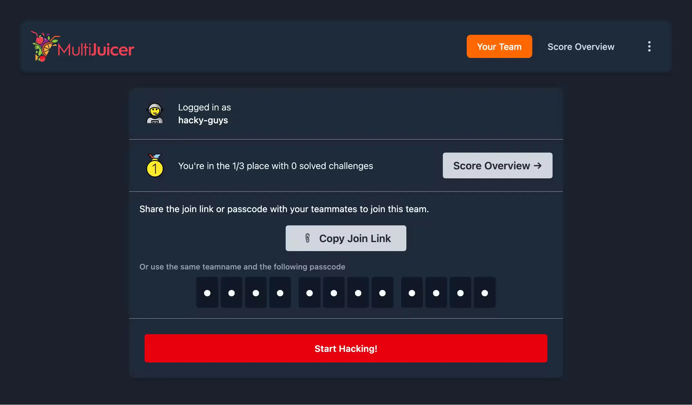
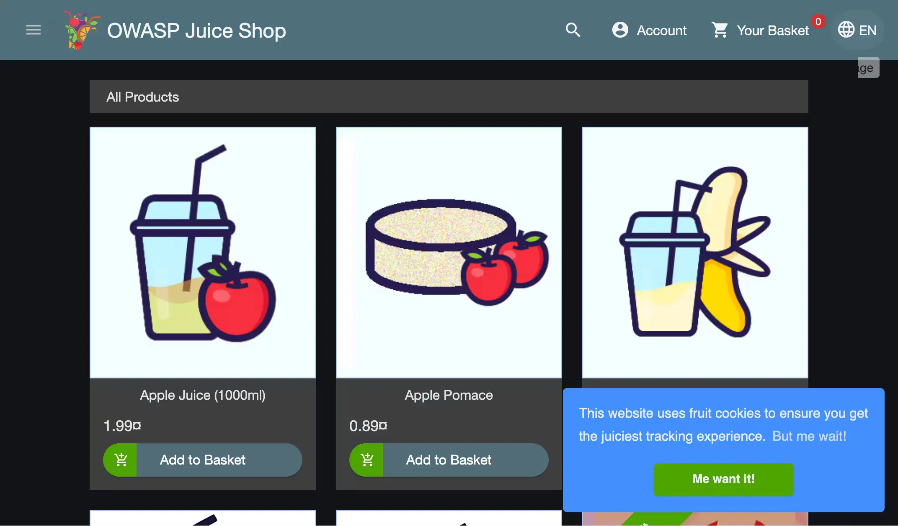
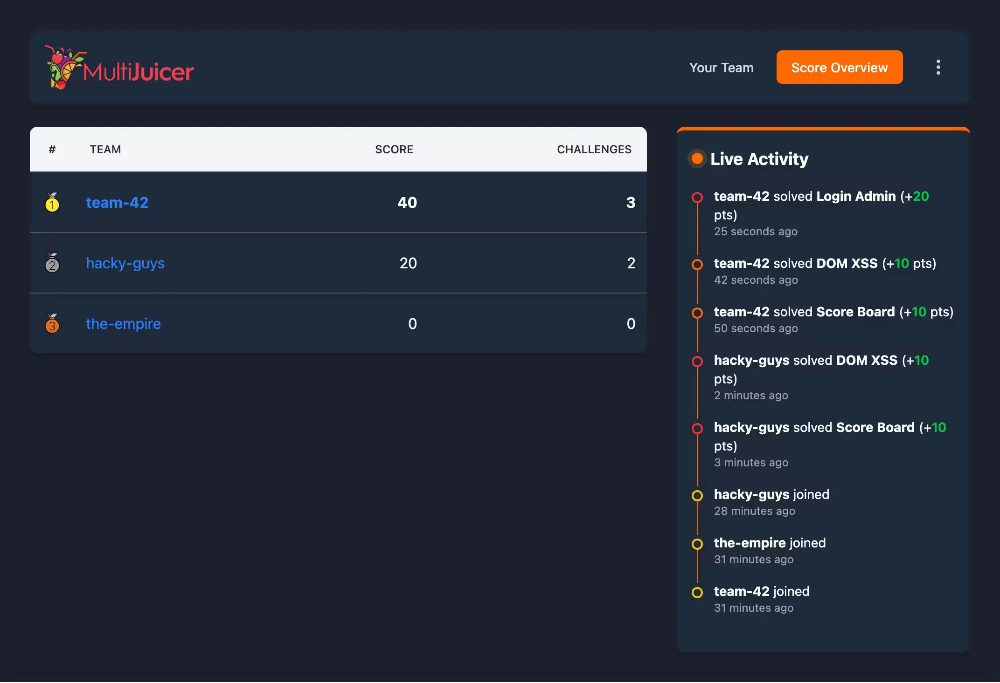
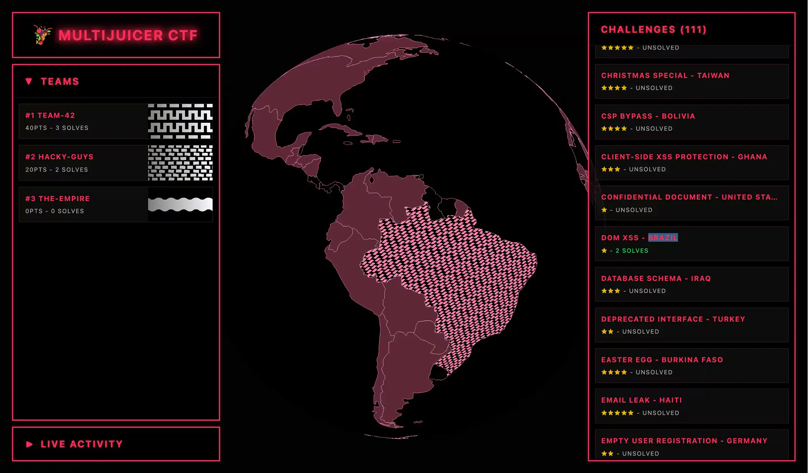
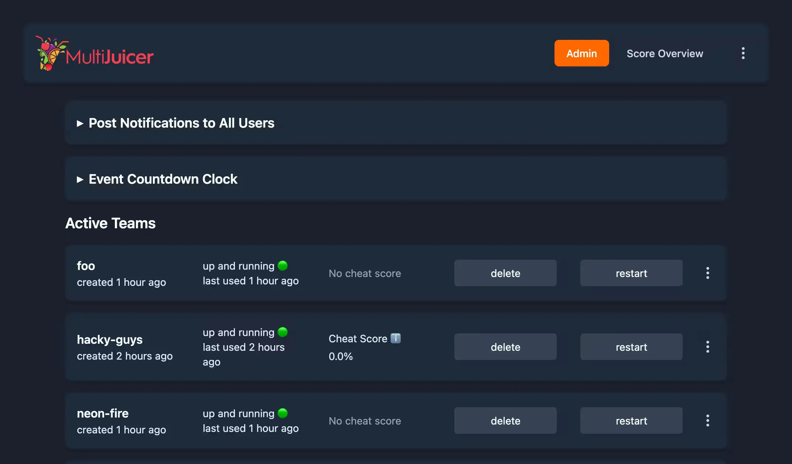

# MultiJuicer Walkthrough

A quick visual tour of how participants join a MultiJuicer event and what hosts see during one.

## 1. Registration

Participants open the MultiJuicer URL and pick a team name. Existing team members can join with a passcode; new teams get one generated for them.

## 2. Instance starting

After joining, MultiJuicer spins up a dedicated JuiceShop instance for the team. The user sees a waiting screen until the pod is ready (usually a few seconds, depending on the speed of underlying CPU and wheater the node already has the Juice Shop image cached).

## 3. What happens behind the scenes

Under the hood MultiJuicer creates a separate Kubernetes Deployment per team. Admins can inspect them directly with `kubectl`:

## 4. Instance ready

Once the pod is up the waiting screen flips to a "ready" state with a **Start Hacking** button. Clicking it sends the participant to their personal JuiceShop.

## 5. Playing JuiceShop

After clicking **Start Hacking** the participant lands in their personal JuiceShop. From here on they use JuiceShop normally — the MultiJuicer LoadBalancer transparently routes their traffic to the right instance.

## Scoreboard

The scoreboard lists every team and their solved-challenge progress. Useful during the event so participants can compare standings. The ScoreBoard also allows for detail pages for challenges and teams, to see which teams have solved which challenges.

## CTF / projector view

The CTF view is primarily meant for in-person events, something to put on a projector for some additional visual eye candy and to spread some hacker vibes.

## Admin interface

Hosts get a dedicated admin page to manage the running event: list all team instances, restart or delete them, reset team passcodes, broadcast a notification message to every participant and set an end date for the event.

