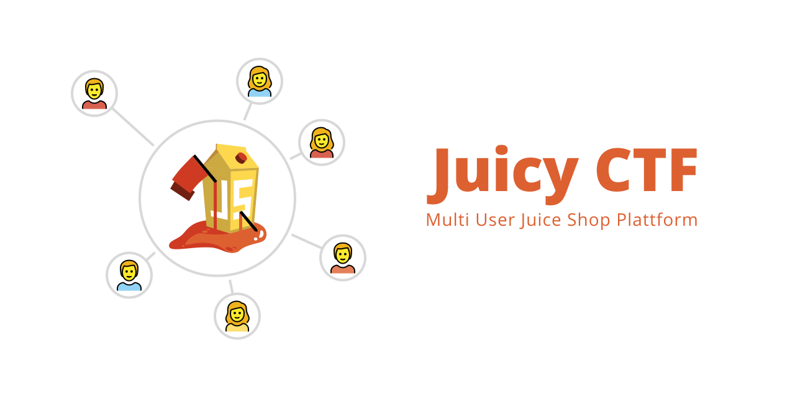

Running CTFs and Security Trainings with [OWASP Juice Shop](https://github.com/bkimminich/juice-shop) is usually quite tricky, Juice Shop just isn't intended to be used by multiple users at a time.
Instructing everybody how to start Juice Shop on their own machine works ok, but takes away too much valuable time.

MultiJuicer gives you the ability to run separate Juice Shop instances for every participant on a central kubernetes cluster, to run events without the need for local Juice Shop instances.

> **Note:** This project was called JuicyCTF until recently. This was changed to avoid confusions with the [juice-shop-ctf](https://github.com/bkimminich/juice-shop-ctf) project.

**What it does:**

- dynamically create new Juice Shop instances when needed
- runs on a single domain, comes with a LoadBalancer sending the traffic to the participants Juice Shop instance
- backup and auto apply challenge progress in case of Juice Shop container restarts
- cleanup old & unused instances automatically


## Installation

MultiJuicer runs on kubernetes, to install it you'll need [helm](https://helm.sh).

```sh
helm repo add multi-juicer https://iteratec.github.io/multi-juicer/

# for helm <= 2
helm install multi-juicer/multi-juicer --name multi-juicer

# for helm >= 3
helm install multi-juicer multi-juicer/multi-juicer
```

### Installation Guides for specific Cloud Providers

Generally MultiJuicer runs on pretty much any kubernetes cluster, but to make it easier for anybody who is new to kubernetes we got some guides on how to setup a kubernetes cluster with MultiJuicer installed for some specific Cloud providers.

- [Digital Ocean](./guides/digital-ocean/digital-ocean.md)
- [OpenShift](./guides/openshift/openshift.md)
- [AWS](./guides/aws/aws.md)
- [\[WIP\]Azure](./guides/azure/azure.md)

### Customizing the Setup

You got some options on how to setup the stack, with some option to customize the JuiceShop instances to your own liking.
You can find the default config values under: [helm/multi-juicer/values.yaml](./helm/multi-juicer/values.yaml)

Download & Save the file and tell helm to use your config file over the default by running:

```sh
helm install -f values.yaml multi-juicer ./multi-juicer/helm/multi-juicer/
```

### Deinstallation

```sh
helm delete multi-juicer
```

## FAQ

### How much compute resources will the cluster require?

To be on the safe side calculate with:

- _1GB memory & 1CPU overhead_, for the balancer, redis & co
- _200MB & 0.2CPU \* number of participants_, for the individual JuiceShop Instances

The numbers above reflect the default resource limits. These can be tweaked, see: [Customizing the Setup](#customizing-the-setup)

### How many users can MultiJuicer handle?

There is no real fixed limit. (Even thought you can configure one 😉)
The custom LoadBalancer, through which all traffic for the individual Instances flows, can be replicated as much as you'd like.
You can also attach a [Horizontal Pod Autoscaler](https://kubernetes.io/docs/tasks/run-application/horizontal-pod-autoscale/) to automatically scale the LoadBalancer.

When scaling up, also keep an eye on the redis instance. Make sure it is still able to handle the load.

### Why a custom LoadBalancer?

There are some special requirements which we didn't find to be easily solved with any pre build load balancer:

- Restricting the number of users for a deployment to only the members of a certain team.
- The load balancers cookie must be save and not easy to spoof to access another instance.
- Handling starting of new instances.

If you have awesome ideas on how to overcome these issues without a custom load balancer, please write us, we'd love to hear from you!

### Why a separate kubernetes deployment for every team?

There are some pretty good reasons for this:

- The ability delete the instances of a team separately. Scaling down safely, without removing instances of active teams, is really tricky with a scaled deployment. You can only choose the desired scale not which pods to keep and which to throw away.
- To ensure that pods are still properly associated with teams after a pod gets recreated. This is a non problem with separate deployment and really hard with scaled deployments.
- The ability to embed the team name in the deployment name. This seems like a stupid reason but make debugging SOOO much easier, with just using `kubectl`.

### Did somebody actually ask any of these questions?

No 😉

## Talk with Us!

You can reach us in the `#project-juiceshop` channel of the OWASP Slack Workspace. We'd love to hear any feedback or usage reports you got. If you are not already in the OWASP Slack Workspace, you can join via [this link](https://owasp.slack.com/join/shared_invite/enQtNjExMTc3MTg0MzU4LWQ2Nzg3NGJiZGQ2MjRmNzkzN2Q4YzU1MWYyZTdjYjA2ZTA5M2RkNzE2ZjdkNzI5ZThhOWY5MjljYWZmYmY4ZjM)
