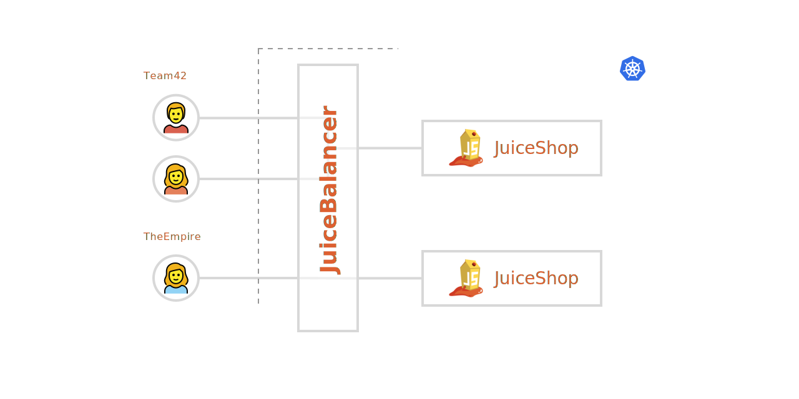

Running CTFs and Security Trainings with OWASP Juice Shop is usually quite tricky, Juice Shop just isn't intended to be used by multiple users at a time.
Instructing everybody how to start Juice Shop on their own machine works ok, but takes away too much valuable time.

JuicyCTF gives you the ability to run separate Juice Shop instances for every participant on a central cluster, giving you the tools to run events without the need for local Juice Shop instances.

What it does:

- dynamically create new Juice Shop instances when needed
- runs on a single domain, comes with a loadbalancer sending the traffic to the participants Juice Shop instance
- backup and autoapply challenge progress in case of Juice Shop container restarts
- cleanup old & unused instances automatically



## Installation

To install JuicyCTF you'll need [helm](https://helm.sh).

If you aren't familiar with helm, try out the helm 3 alpha.
It's easier to install and use, as it doesn't require an installation on the kubernetes cluster to work.

```sh
git clone git@github.com:J12934/juicy-ctf.git

# First we'll need to fetch the charts JuicyCTF depends on
helm dependency update ./juicy-ctf/helm/juicy-ctf/

# Now we can install the helm chart
# The first juicy-ctf part is the release name, safe to change to whatever you like.
helm install juicy-ctf ./juicy-ctf/helm/juicy-ctf/
```

## Example Installations at Cloud Providers

We got some more complete guides on how to set up a kubernetes cluster with JuciyCTF on some popular cloud providers:

- [Digital Ocean](./examples/digital-ocean/digital-ocean.md)

### Deinstallation

```sh
helm delete juicy-ctf
# Also delete all Juice Shop Deployments which still exist
kubectl delete deployment --selector app=juice-shop && kubectl delete service --selector app=juice-shop
```

## FAQ

### Why a custom LoadBalancer?

There are some special requirements which we didn't find to be easily solved with any pre build load balancer:

- Restricting the number of users for a deployment to only the members of a certain team.
- The load balancers cookie must be save and not easy to spoof to access another instance.
- Handling starting of new instances.

If you have awesome ideas on how to overcome these issues without a custom load balancer, please write us, we'd love to hear from you!

### Why a separate kubernetes deployment for every team?

There are some pretty good reasons for this:

- The ability delete the instances of a team separately. Scaling down safely, without removing instances of active teams, is really tricky with a scaled deployment. You can only choose the desired scale not which pods to keep and which to throw away.
- To ensure that pods are still properly associated with teams after a pod gets recreated. This is a non problem with separate deployment and really hard with scaled deployments.
- The ability to embed the team name in the deployment name. This seems like a stupid reason but make debugging SOOO much easier, with just using `kubectl`.

### Did somebody actually ask any of these questions?

No 😉
